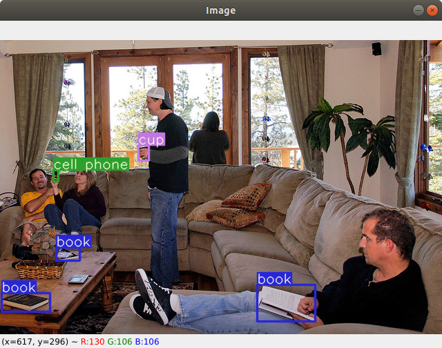

# coco2yolo

## Functions

- Extract some certains classes from the COCO dataset
- Convert json labels to VOC xml labels and yolo txt labels

## Requirements

- pycocotools
- cv2
- matplotlib
- shutil
- tqdm
- scikit-image
- PIL
- lxml
- xml

## Usage

1. Extract certain classes from COCO dataset and convert COCO dataset json label to VOC xml label
```python
python3 coco2voc.py  # you need to specify the correct path for dataset first
```

2. Convert VOC xml label to yolo txt label(each line uses "class_id cx cy w h" to represent a bbox)
```python
python3 voc2yolo.py  # you need to specify the correct path for dataset's labels first
```

3. To test converted yolo txt label is correct or not
```python
python3  test_yolo_labels.py  # you need to specify the correct path for images and converted txt labels first
```
Bboxes are plotted from yolo txt labels, you will see pictures like this:

